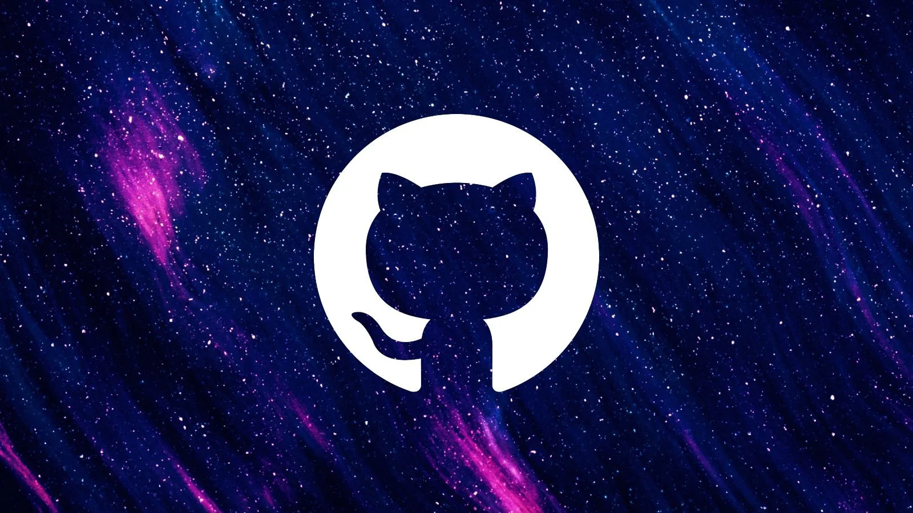

<h1 align="center">👩🏻‍💻 Final Lab</h1>

<h2 align="center">Practical Class Build

 </h2>
  
<h3 align="center">👉 Learn to Follow Instructions 👈  
  

           
</h3>

### <samp>The following procedure will change your life:</samp>

<table><tr><td>
  
  - Create a repository on GitHub with a **README.md**

- Pull repository down onto your machine `using the terminal`

- Update **README.md** file using sublime, and commit up to your origin (GitHub) repository `using the terminal`

- Create a branch `using the terminal`, and push it up to your origin (GitHub) repository `using the terminal`

- Create an index.html file about your favourite pet! Have fun with this - images, header tags, layout, etc. Go crazy! 🐱‍💻

- Push your changes to your origin (GitHub) repository `using the terminal`, on your created branch.

- Create a pull request on GitHub to merge your branch into master. Make sure your title and description are descriptive! What did you add? How would someone go around testing the code? Include some screenshots!

- Review and approve the pull request before merging. Don’t just comment saying “looks good!” and merge, and definitely don’t just merge the code in after creating the pull request.

- Switch back to master branch on your local repository, `using the terminal`

- Pull the changes
  
  </td></tr></table>

### <samp>Show me:</samp>

- [x] Your website in browser!

- [x] Your GitHub repository, including your updated README.md, the pull request you made, and the approval of said pull request

- [x] Your local branch - show me that you’re on master!

<h3 align="center"><samp>BEFORE YOU GO, TAKE NOTE:
  
 </samp></h3>

<b>⚠️ DO NOT SUBMIT ZIPPED FILES ⚠️</b>

<b>👩🏻‍💻 ONLY THE MAIN BRANCH WILL BE GRADED 👩🏻‍💻</b>

